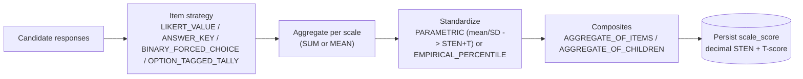
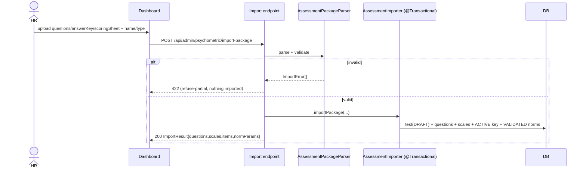

# Pulse Backend — Psychometric Scoring & Admin Service

Spring Boot service (package `com.edge.pulse`) for the Pulse talent-intelligence platform. This README focuses on the **psychometric subsystem**: the scoring engine that reproduces Beacon Red's vendor scoring natively in Java, the CSV import pipeline that onboards new assessments as data, and the admin APIs that drive both.

- **Stack:** Java 25, Spring Boot 4.0.2, Gradle, Spring Data JPA + PostgreSQL, Flyway, Spring Data Redis, Spring Security, JUnit 5 + Mockito, Lombok.
- **Auth:** Spring Security (default-deny), JWT + X4Auth/Entra; DB-backed RBAC.
- **Operator/HR guide:** [`ai/docs/psychometric-assessment-guide.md`](../../../ai/docs/psychometric-assessment-guide.md) — how HR imports, activates, assigns, and reads results.
- **Design spec:** [`ai/specs/2026-06-23-psychometric-scoring-engine-design.md`](../../../ai/specs/2026-06-23-psychometric-scoring-engine-design.md).

---

## What this service does

It scores psychometric assessments and exposes the admin surface to manage them. Responses flow through a single declarative pipeline:

```
responses → per-item transform → scale aggregate → standardize(norm) → composites
```

No per-assessment code: an assessment is config (items, scales, norms, composites) loaded from the relational schema. New assessments arrive as a three-CSV package and onboard with **zero new code**.

## Scoring engine architecture

The engine is a **pure, JPA-free `ScoringCalculator`** that operates on plain config + response records and returns score records. `ScoringService` is the JPA adapter: load config → calculator → persist. Because the calculator has no database dependency, it is unit-tested directly against vendor CSV fixtures for bit-for-bit parity.

Each stage of the pipeline is a **named, pluggable strategy** (no math literals in the orchestrator; all constants live in data):

**Package:** `com.edge.pulse.services.psychometric.scoring`

- `ScoringCalculator` — pure orchestration.
- `item/` — **`ItemStrategy`** + impls: `LikertValueStrategy` (FORWARD as-is; REVERSE `(min+max)−value`, idempotent), `AnswerKeySingleStrategy`, `AnswerKeyMultipleStrategy`, `BinaryForcedChoiceStrategy`, `OptionTaggedTallyStrategy`, `AdjectiveCountStrategy`. Selected via `ItemStrategies`.
- `norm/` — **`NormStrategy`** + impls: `ParametricNormStrategy` (`z=(raw−M)/SD`; `STEN=z×2+5.5`; `T=z×factor+offset`, with factor/offset/clip parameterized per scale) and `EmpiricalPercentileStrategy` (rank vs reference distribution → percentile). Selected via `NormStrategies`.
- `composite/` — **`CompositeStrategy`** + `AggregateOfChildrenStrategy` (mean/sum of children's *standardized* scores) and the `AGGREGATE_OF_ITEMS` path. Selected via `CompositeStrategies`.
- `model/` — pure config/result records (`ItemConfig`, `ScaleConfig`, `NormConfig`, `ItemResponse`, `ScaleScoreResult`, `ScoringInput`, `ScoringOutput`).



**Precision rule:** STEN/T/z are computed and stored at full precision; rounding happens **once**, at display, never chained. The notebooks round with numpy `.round()` (banker's rounding), so display rounding uses `RoundingMode.HALF_EVEN`. The parity harness is the arbiter — if a value mismatches, suspect the rounding mode first.

### Parity harness

The engine reproduces Beacon Red's exact per-scale z / T / STEN and composites. Fixtures and the harness:

- **Fixtures:** `src/test/resources/psychometric/parity/{atp,ca,pti}/` — each holds the input package CSVs (e.g. `pti/questions.csv`, `answer_key.csv`, `scoring_sheet.csv`) plus reference outputs.
- **Tests:** `src/test/java/com/edge/pulse/services/psychometric/scoring/parity/` — `AtpParityTest`, `PtiParityTest`, `CaParityTest`, `PtiImportParityTest`, with `ParityFixtureLoader` and `ParityAsserter`. They replay inputs through `ScoringCalculator` and assert per-scale outputs equal the vendor's to its exact precision, per candidate. This is the regression guard for every future norm/engine change.

## CSV import pipeline

An assessment package is **three CSVs** — `questions.csv`, `answer_key.csv`, `scoring_sheet.csv`. See the [operator guide](../../../ai/docs/psychometric-assessment-guide.md#the-assessment-package) for the full column reference and worked examples.

**Package:** `com.edge.pulse.services.psychometric.imports`

- `CsvReader` — minimal RFC-4180 reader (header → row maps). Hand-rolled, **no new dependencies** (keeps the air-gapped k2 build clean).
- `AssessmentPackageParser` — turns the three CSVs into a validated `ParsedPackage` (no DB). Reports column-level `ImportError`s.
- `AssessmentImporter` — transactional orchestration over the existing `PsychometricAdminService` create methods (createTest → addQuestion → createScale → saveScoringKey → parametric norms), mapping package names → generated UUIDs. **Refuse-partial:** any error → rollback, no writes.

**Endpoint:** `POST /api/admin/psychometric/import-package` (`AdminAssessmentImportController`), `multipart/form-data`. Requires `ASSESS_CREATE` **and** `ASSESS_KEY_MANAGE`.

- Parts: `questions`, `answerKey`, `scoringSheet` (files); params `testName`, `testType` (`PERSONALITY|COGNITIVE|COMPETENCY`), optional `description`, `timeLimitSecs`.
- On any parse or referential error → **HTTP 422** with an `ImportResultDto` carrying a list of `ImportError {file, row, column, message}`; nothing is imported.
- On success → the test is created in **DRAFT** with its scoring key **ACTIVE** and its norms **VALIDATED**. This is by design: Beacon Red delivers finalized norms and scale-maps, so the importer applies them directly with no staging step. The human review gate is the **test lifecycle status** — a test must be explicitly activated (`POST /tests/{id}/activate`) before it can be assigned or taken. Re-importing always creates a **new DRAFT test**; it never hot-swaps a live one, so there is no separate stage → promote step for keys or norms.



Adjacent admin endpoints (`AdminPsychometricController`, base `/api/admin/psychometric`): `POST /tests/{id}/activate`, `PUT /tests/{id}/visibility-policy`, `GET /tests/{id}/results`, `/results/{resultId}`, `/tests/{id}/analytics`. Assignment reuses `POST /api/admin/form-assignments/assign`.

## Key migrations

Flyway migrations in `src/main/resources/db/migration/` (baseline `V1`; the engine work is additive on top):

- **`V7__psychometric_scoring_engine.sql`** — decimal STEN (`scale_score.sten_score` INT → `NUMERIC(4,2)`, `norm_entry.sten_score` likewise); add `scale_score.t_score`; parameterized T-score on `norm_scale_param` (`t_factor`/`t_offset`/`t_clip_lo`/`t_clip_hi`, defaults 10/50/10/120); composite definition on `psychometric_scale` (`composite_method`, `composite_basis`); `norm_table_version.norm_strategy`; `scoring_key_item.item_strategy`; result-state + validity columns on `test_result`. Drops/recreates `mv_psychometric_scale_stats` around the STEN type change.
- **`V8__import_pipeline.sql`** — `psychometric_scale.composite_rounding_scale` (NULL = 1 dp); `candidate_answer.tag_scale_id` (+ index) for `OPTION_TAGGED_TALLY` (VIP) per-option scale tagging.

`norm_scale_param` (parametric norms) originates in `V2`; `norm_entry` (empirical percentile) is reused, not replaced.

## Running locally

Prerequisites: Java 25, PostgreSQL (`localhost:5432/pulse`), Redis (`localhost:6379`). `docker compose up` from the repo root starts Postgres + Redis.

```bash
# from Service/pulse/pulse/
SPRING_PROFILES_ACTIVE=local ./gradlew bootRun
```

The `local` profile disables rate limiting and uses the local JWT secret from `application-local.yaml`. Flyway runs migrations on startup. Boot the server before committing schema/JPA changes — Flyway and column issues surface only at runtime, not in unit tests. After structural Java renames run `./gradlew clean` first (stale `.class` files cause "bad class file").

## Running the tests

```bash
# from Service/pulse/pulse/
./gradlew test                          # full suite
./gradlew test --tests "*ParityTest"    # scoring parity only (no DB)
./gradlew test --tests AtpParityTest     # one parity class
```

The parity tests run against the CSV fixtures with no database, so they are fast and deterministic — run them after any change to the scoring engine, strategies, or norm handling.
