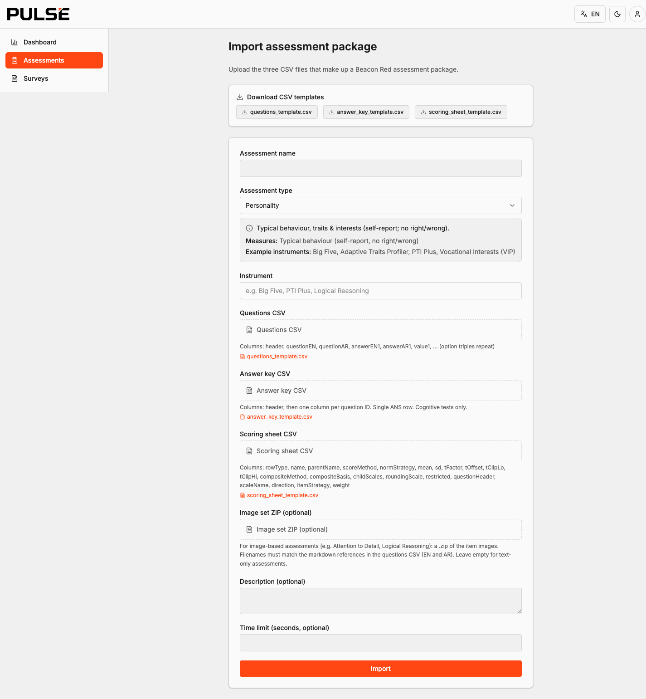
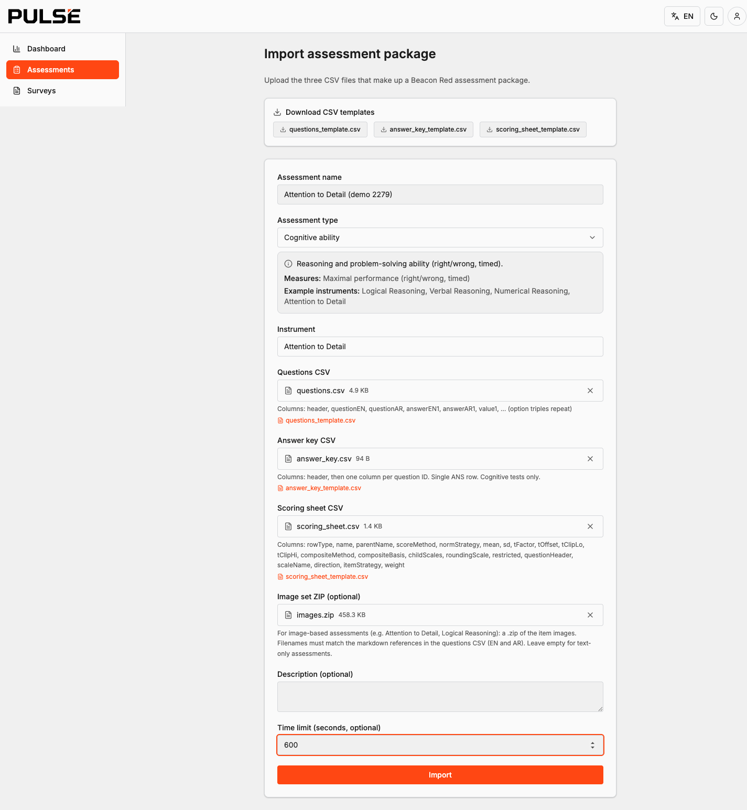
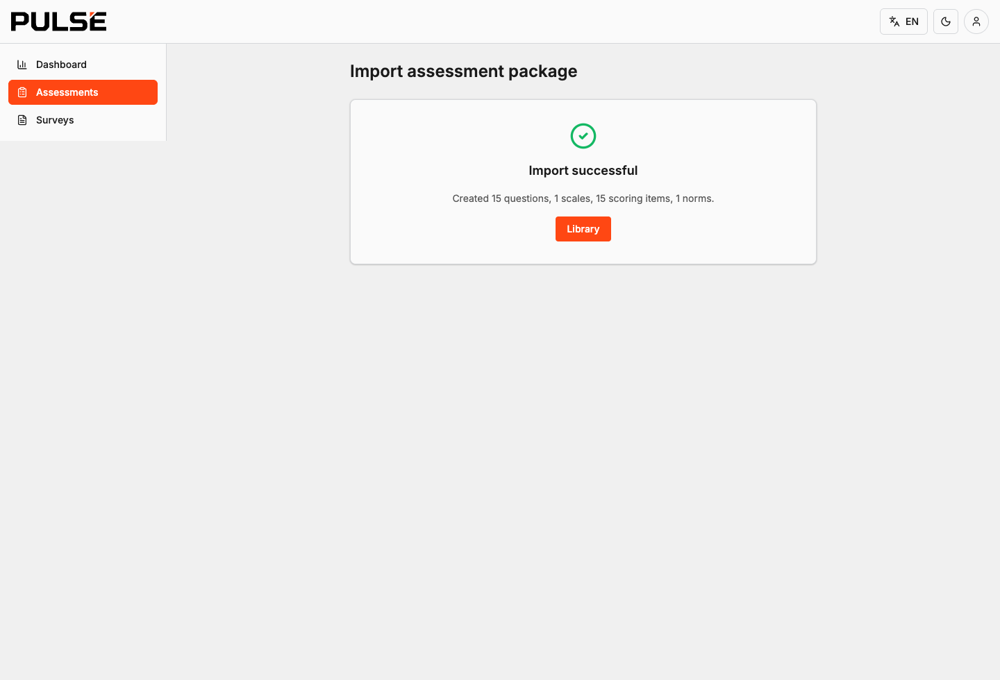
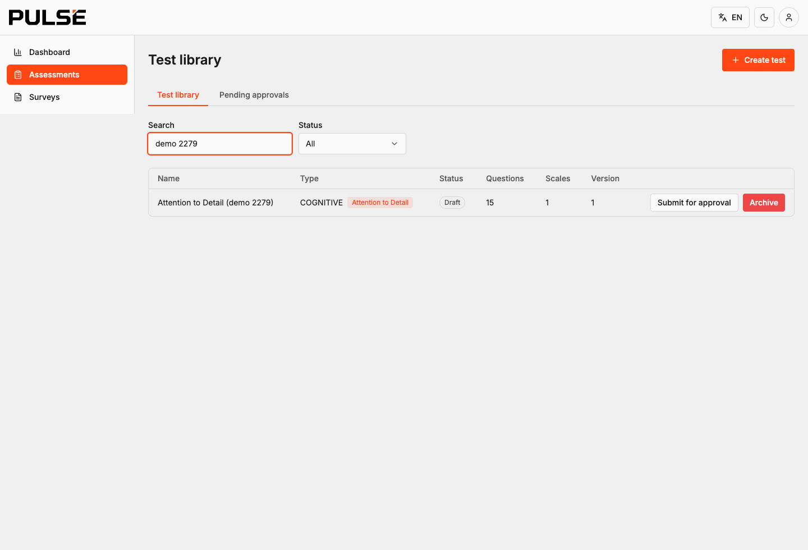
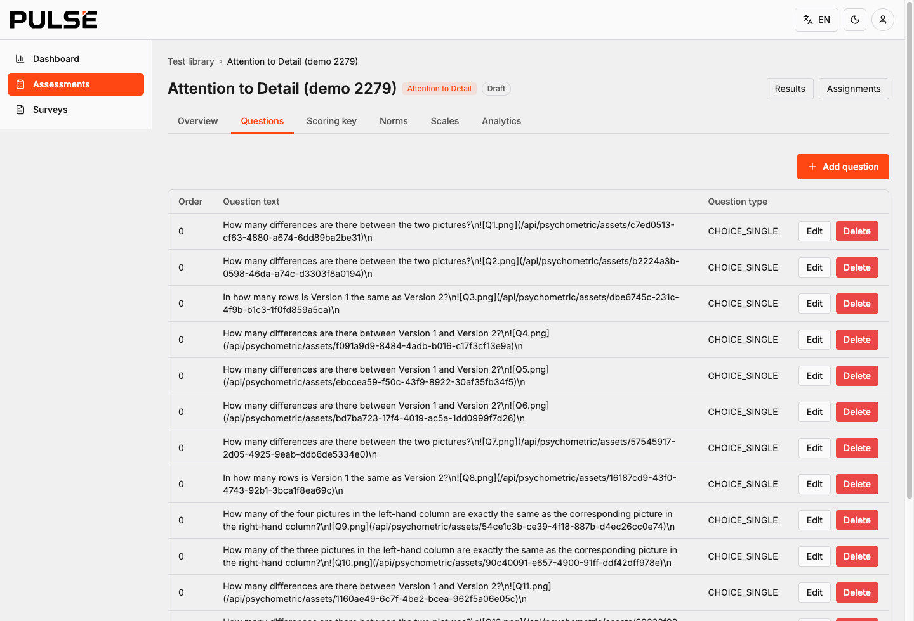

# Pulse — Sample Assessment Packages (Demo)

Ready-to-import sample assessments built from the Beacon Red source material, in the exact
format the Pulse dashboard ingests. Use them to demo **(1) inserting an assessment** and
**(2) deriving scores from candidate answers** — including the picture-based tests.

Each folder is one assessment. A package is **3 CSVs** (+ an **image ZIP** for picture tests):

| File | Purpose |
|------|---------|
| `questions.csv` | The items candidates see (bilingual EN/AR; image items embed markdown image refs) |
| `answer_key.csv` | Correct answers — **cognitive tests only** (`header` row of question ids + one `ANS` row). Personality tests ship a header-only file. |
| `scoring_sheet.csv` | Scales, norms (mean/SD), item→scale mapping, composites |
| `images.zip` | The item images — **Attention to Detail** and **Logical Reasoning** only |
| `sample_responses.csv` / `expected_scores.csv` | Demo candidate answers + the scores they derive to (for the "derive answers" part) |

## What's included

| Folder | Type | Time-limited | Images | Imports cleanly? |
|--------|------|:---:|:---:|:---:|
| `pti-plus/` | Personality | – | – | ✅ |
| `attention-to-detail/` | Cognitive | ✓ | ✓ | ✅ |
| `verbal-reasoning/` | Cognitive | ✓ | – | ✅ |
| `numerical-reasoning/` | Cognitive | ✓ | – | ✅ |
| `logical-reasoning/` | Cognitive | ✓ | ✓ | ⚠️ see *Known limitations* |
| `adaptive-traits-profiler/` | Personality | – | – | ⚠️ see *Known limitations* |

---

## Part 1 — How to insert an assessment (step by step)

> You need to be signed in as an admin with assessment permissions (`ASSESS_CREATE` / `ASSESS_UPDATE`).
> Cognitive tests are timed and keyed; personality tests are untimed and not keyed.

### Step 1 — Open the import wizard
Go to **Assessments → Import assessment**. You'll see the three CSV slots, the optional image-set
slot, and links to download blank templates.



### Step 2 — Fill the details and attach the files
- **Assessment name** — e.g. *Attention to Detail*.
- **Assessment type** — pick **Cognitive ability** for the reasoning/detail tests (the panel explains
  what each type measures), or **Personality** for PTI Plus.
- **Instrument** (optional) — the specific test name, e.g. *Attention to Detail*.
- **Time limit** — set it for cognitive tests (e.g. `600` seconds).
- Attach `questions.csv`, `answer_key.csv`, `scoring_sheet.csv`, and — for a picture test —
  the **Image set ZIP**. (Leave the image slot empty for text-only tests.)



### Step 3 — Import
Click **Import**. The server validates the package, uploads the images, and **rehosts** each image
to an authenticated URL. On success you'll see how many questions, scales, scoring items, and norms
were created. (If anything is wrong, the import is refused as a whole with a row-by-row error table —
nothing is partially imported.)



### Step 4 — Find it in the library
The new test appears in the **Test library** (in `DRAFT` — it must clear approval before it can be
assigned to employees).



### Step 5 — Review the imported items
Open the test → **Questions**. Each item is listed; for picture tests the body carries the rehosted
image URL (`/api/psychometric/assets/…`), which renders in the candidate app.



---

## Part 2 — How to derive answers (scoring)

Each folder includes demo data so you can show scoring without live candidates:

- **`sample_responses.csv`** — a handful of candidates' raw answers (the value chosen per question).
- **`expected_scores.csv`** — the scores those answers derive to (scale **STEN** 1–10, and for
  personality also **T-scores**).

The scoring path: each answer maps to its scale (via `scoring_sheet.csv`), raw scores are summed,
then converted to a **STEN** using the scale's norm (mean/SD). Cognitive items are right/wrong against
`answer_key.csv`; personality items are Likert/forced-choice with reverse-keyed items handled
automatically. To show it live: import the test → approve it → assign it to a test user → take it on
the device, and the results screen shows the band-first STEN profile.

---

## Cross-test composite (Cognitive Ability overall)

Beacon Red derives an overall **CA / IQ** score as the average of the four cognitive sub-tests
(Logical, Verbal, Numerical, Attention to Detail). That spans multiple tests, so it isn't part of any
single import package. After importing the four cognitive tests, configure it in Pulse as a
**Competency** (`Assessments → Competencies`) whose weighted scales are the four `*_sum` scales —
Pulse computes it as a reverse-aware weighted mean of their STENs.

---

## Known limitations (source / platform, not the packages)

- **Logical Reasoning images** — the Beacon Red image set only ships pictures for **Q1–Q13** of the
  20 items (Q14–Q20 reference images that aren't in the delivered set). Importing with the current
  `images.zip` is refused on the first missing image. To demo LR end-to-end, obtain the complete LR
  image set from Beacon Red (filenames must match the markdown refs in `questions.csv`), or demo the
  picture flow with **Attention to Detail** (complete).
- **Adaptive Traits Profiler** — ATP is a *binary forced-choice* personality instrument. The importer
  currently maps forced-choice items to a single-choice question type, which the platform disallows on
  a personality test, so ATP question-import is blocked pending forced-choice import support. Its
  scoring is validated; only the question-import step is pending. (PTI Plus is the working personality
  demo.)

**Clean demo set today:** PTI Plus (personality) + Attention to Detail (picture cognitive) + Verbal &
Numerical Reasoning (text cognitive).

---

## Regenerating

These packages are generated from `br/` + the Phase-1 parity scoring configs by `_generate.py`
(re-runnable; it diffs the PTI scoring sheet against the committed parity golden before trusting
itself):

```
python3 samples/_generate.py
```
